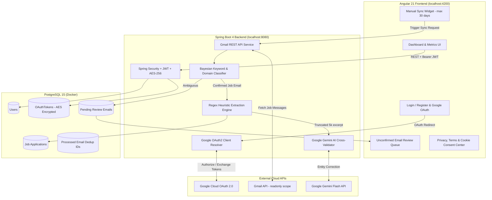

# Job Tracker 🎯

[](LICENSE)
[](https://openjdk.org/)
[](https://spring.io/projects/spring-boot)
[](https://angular.dev)
[](https://www.postgresql.org/)
[](https://ai.google.dev/)
[](.github/workflows/secret-scan.yml)

**Job Tracker** is an automated, privacy-first career utility designed to streamline job search management. By integrating directly with your Gmail account via Google OAuth 2.0, Job Tracker scans and catalogs job application updates (Applied, Interviewing, Rejected, Offer), parses company and position details using a multi-tiered heuristic regex and Gemini AI pipeline, and provides an actionable metrics dashboard.

---

## 🏛️ System Architecture



---

## ✨ Key Features

- **Automated Gmail Synchronization:** Query your inbox for application updates within a customizable range (up to 30 days). Strictly searches for recruitment and job notification patterns.
- **Multi-Tiered Extraction Engine:**
  1. **Strict Query Filters:** Only targets application status emails.
  2. **Regex Heuristics:** Instant, local extraction of companies, job IDs, and status.
  3. **Gemini AI Validation:** Truncates body text to 5,000 characters and sends it to `gemini-3.5-flash-lite` for entity validation and missing field repair.
  4. **Bayesian Safety Net:** Ambiguous emails are routed to a human-in-the-loop review tab, training the local classifier upon review.
- **Enterprise-Grade Security:**
  - Zero plaintext secrets in repository.
  - Google OAuth refresh tokens encrypted at rest with **AES-256**.
  - Passwords hashed with BCrypt.
  - Authenticated session management via signed JWTs.
- **Comprehensive Compliance & Privacy:**
  - Compliant with **Google API Services User Data Policy** and **Limited Use requirements**.
  - In-app Privacy Policy, Terms of Service, Cookie Policy, and Interactive Cookie Consent Banner.
  - Explicit user data usage consent required on registration.

---

## 📋 Prerequisites

Before running the project locally, ensure you have the following installed:

- **Java Development Kit (JDK):** Version 17 or higher (`java -version`)
- **Node.js & npm:** Node.js 20+ and npm 10+ (`node -v`, `npm -v`)
- **Docker & Docker Compose:** For running PostgreSQL (`docker compose version`)
- **Google Cloud Console Project:** With the Gmail API enabled
- **Google AI Studio API Key:** For Gemini AI parsing

---

## 🚀 Quickstart Local Setup

### 1. Clone the Repository
```bash
git clone https://github.com/<your-username>/Tracker.git
cd Tracker
```

### 2. Configure Environment Variables
Copy the template configuration file:
```bash
cp .env.example .env
```
Open `.env` and fill in your values (database password, Google Client ID/Secret, Gemini API Key, AES encryption key).

### 3. Start PostgreSQL Database
```bash
docker compose up -d
```
Verify the container is running:
```bash
docker ps --filter "name=job_tracker_db"
```

### 4. Start the Spring Boot Backend
Navigate to the `backend` folder and run with the Maven wrapper:
```bash
cd backend
# On Linux / macOS:
./mvnw spring-boot:run

# On Windows (PowerShell / Command Prompt):
.\mvnw.cmd spring-boot:run
```
The backend will launch on `http://localhost:8080`.

### 5. Start the Angular Frontend
In a separate terminal, navigate to the `frontend` folder:
```bash
cd frontend
npm install
npm start
```
Open your browser and navigate to `http://localhost:4200`.

---

## 🔑 Google Cloud OAuth 2.0 Setup Guide

Because Job Tracker interacts with Gmail using the restricted `gmail.readonly` scope, configure Google Cloud Console as follows:

### Step 1: Create a Project & Enable Gmail API
1. Navigate to the [Google Cloud Console](https://console.cloud.google.com/).
2. Create a new project named **Job Tracker**.
3. Go to **APIs & Services > Library**, search for **Gmail API**, and click **Enable**.

### Step 2: Configure OAuth Consent Screen
1. Go to **APIs & Services > OAuth consent screen**.
2. Select **User Type: External** and click **Create**.
3. Fill in:
   - **App name:** Job Tracker
   - **User support email:** Your email address
   - **Developer contact information:** Your email address
4. Under **Scopes for Google APIs**, click **Add or Remove Scopes** and add:
   - `https://www.googleapis.com/auth/gmail.readonly`
   - `openid`
   - `profile`
   - `email`
5. Under **Test Users**, add the Gmail addresses you will use for testing (while in Google "Test Mode", refresh tokens expire after 7 days).

### Step 3: Create Web OAuth Client Credentials
1. Go to **APIs & Services > Credentials > Create Credentials > OAuth client ID**.
2. Select **Application type:** Web application.
3. Name: `Job Tracker Web Client`.
4. Set **Authorized JavaScript origins**:
   - `http://localhost:4200`
5. Set **Authorized redirect URIs**:
   - `http://localhost:8080/login/oauth2/code/google`
6. Copy the generated **Client ID** and **Client Secret** into your `.env` file (`GOOGLE_CLIENT_ID` and `GOOGLE_CLIENT_SECRET`).

---

## 🤖 Google Gemini AI Setup

1. Visit [Google AI Studio](https://aistudio.google.com/).
2. Click **Get API key** and generate a new key.
3. Paste the key into your `.env` file under `GEMINI_API_KEY`.

---

## ⚙️ Environment Variables Reference

| Variable Name | Description | Default / Example |
| :--- | :--- | :--- |
| `POSTGRES_DB` | PostgreSQL database name | `jobtracker` |
| `POSTGRES_USER` | PostgreSQL user | `tracker_user` |
| `POSTGRES_PASSWORD` | PostgreSQL password | *Set in `.env`* |
| `SPRING_DATASOURCE_URL` | JDBC connection URL | `jdbc:postgresql://localhost:5432/jobtracker` |
| `JWT_SECRET` | Secret key for signing JWT tokens (min 32 chars) | *Set in `.env`* |
| `JWT_EXPIRATION_MS` | JWT token validity in milliseconds | `86400000` (24h) |
| `GOOGLE_CLIENT_ID` | OAuth 2.0 Web Client ID from Google Cloud | *Set in `.env`* |
| `GOOGLE_CLIENT_SECRET` | OAuth 2.0 Web Client Secret from Google Cloud | *Set in `.env`* |
| `GEMINI_API_KEY` | API Key from Google AI Studio | *Set in `.env`* |
| `GEMINI_API_URL` | Endpoint for Gemini model generation | `https://generativelanguage.googleapis.com/...` |
| `ENCRYPTION_SECRET` | 16, 24, or 32-byte key for AES-256 token encryption | *Set in `.env`* |

---

## 🔒 Security & Compliance

- **Zero Hardcoded Secrets:** All credentials, keys, and tokens are read strictly from environment variables or ignored `.env` files.
- **Automated Secret Scanning:** Continuous integration scans all commits using [Gitleaks](https://github.com/gitleaks/gitleaks) to prevent accidental credential leakage.
- **Google Limited Use Compliance:** Job Tracker adheres strictly to the [Google API Services User Data Policy](https://developers.google.com/terms/api-services-user-data-policy), including the Limited Use requirements.
- **Responsible Disclosure:** Found a vulnerability? Please review our [Security Policy](SECURITY.md) before reporting.

---

## 📜 Legal & Policies

- [Privacy Policy](PRIVACY.md)
- [Terms and Conditions](TERMS.md)
- [Cookie & Local Storage Policy](COOKIE_POLICY.md)
- [Security Policy](SECURITY.md)
- [Contributing Guide](CONTRIBUTING.md)

---

## 📄 License

This project is licensed under the [MIT License](LICENSE).
