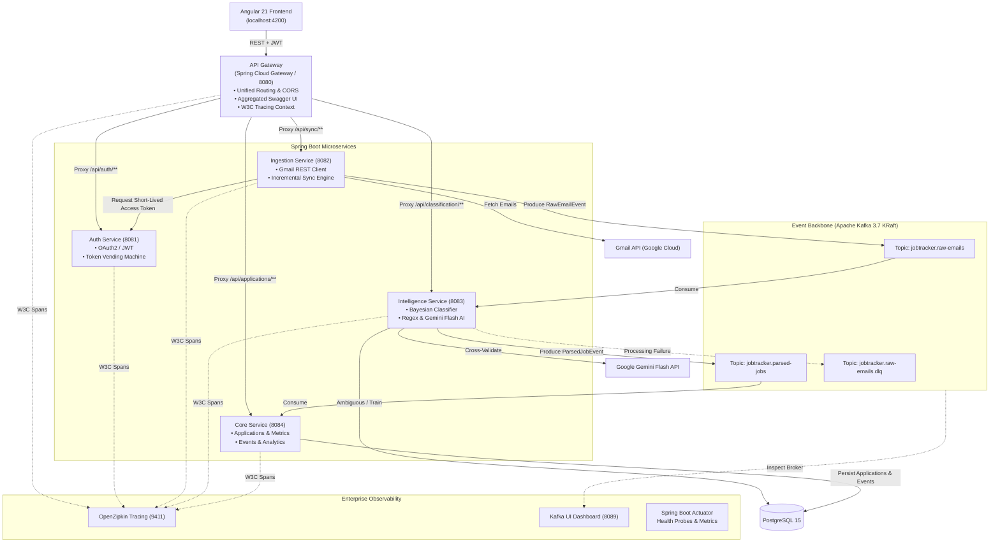

# AGED - Job Tracker

[](LICENSE)
[](https://openjdk.org/)
[](https://spring.io/projects/spring-boot)
[](https://angular.dev)
[](https://kafka.apache.org/)
[](https://zipkin.io/)
[](https://www.postgresql.org/)
[](http://localhost:8080/swagger-ui.html)
[](https://ai.google.dev/)
[](.github/workflows/secret-scan.yml)

**AGED - Job Tracker** is an enterprise-grade, event-driven career management platform designed to automate and streamline your job search. By connecting to Gmail via Google OAuth 2.0, Job Tracker continuously syncs job application updates (Applied, Interviewing, Rejected, Offer), parses company and position details using a multi-tiered heuristic regex and Google Gemini AI pipeline, and provides an actionable metrics dashboard.

The application is built on a **microservices architecture** using Spring Boot, Apache Kafka (KRaft), Micrometer Distributed Tracing (Zipkin), and Angular.

---

## Architecture Overview


```mermaid
graph TD
    Client["Angular 21 Frontend\n(localhost:4200)"]
    Gateway["API Gateway\n(Spring Cloud Gateway / 8080)\n• Unified Routing & CORS\n• Aggregated Swagger UI\n• W3C Tracing Context"]

    subgraph Microservices ["Spring Boot Microservices"]
        Auth["Auth Service (8081)\n• OAuth2 / JWT\n• Token Vending Machine"]
        Ingestion["Ingestion Service (8082)\n• Gmail REST Client\n• Incremental Sync Engine"]
        Intelligence["Intelligence Service (8083)\n• Bayesian Classifier\n• Regex & Gemini Flash AI"]
        Core["Core Service (8084)\n• Applications & Metrics\n• Events & Analytics"]
    end

    subgraph EventStream ["Event Backbone (Apache Kafka 3.7 KRaft)"]
        RawTopic["Topic: jobtracker.raw-emails"]
        ParsedTopic["Topic: jobtracker.parsed-jobs"]
        DLQ["Topic: jobtracker.raw-emails.dlq"]
    end

    subgraph Observability ["Enterprise Observability"]
        Zipkin["OpenZipkin Tracing (9411)"]
        KafkaUI["Kafka UI Dashboard (8089)"]
        Actuator["Spring Boot Actuator\nHealth Probes & Metrics"]
    end

    DB[(PostgreSQL 15)]
    GmailAPI["Gmail API (Google Cloud)"]
    GeminiAPI["Google Gemini Flash API"]

    Client -->|REST + JWT| Gateway
    Gateway -->|Proxy /api/auth/**| Auth
    Gateway -->|Proxy /api/sync/**| Ingestion
    Gateway -->|Proxy /api/classification/**| Intelligence
    Gateway -->|Proxy /api/applications/**| Core

    Ingestion -->|Request Short-Lived Access Token| Auth
    Ingestion -->|Fetch Emails| GmailAPI
    Ingestion -->|Produce RawEmailEvent| RawTopic

    RawTopic -->|Consume| Intelligence
    Intelligence -->|Ambiguous / Train| DB
    Intelligence -->|Cross-Validate| GeminiAPI
    Intelligence -->|Produce ParsedJobEvent| ParsedTopic
    Intelligence -.->|Processing Failure| DLQ

    ParsedTopic -->|Consume| Core
    Core -->|Persist Applications & Events| DB

    Gateway & Auth & Ingestion & Intelligence & Core -.->|W3C Spans| Zipkin
    EventStream -.->|Inspect Broker| KafkaUI
```

---

## Microservices Breakdown

| Service | Port | Description & Responsibilities |
| :--- | :--- | :--- |
| **`gateway`** | `8080` | Entry point for all client traffic. Handles route forwarding, global CORS policy, W3C trace context injection, and aggregates Swagger docs across services into a single UI portal. |
| **`auth-service`** | `8081` | Handles user authentication, Google OAuth2 integration, and JWT signing/validation. Acts as a **Token Vending Machine**—safely custodying refresh tokens and vending short-lived access tokens to downstream services. |
| **`ingestion-service`** | `8082` | Manages Gmail synchronization. Queries Gmail API via targeted date ranges, prevents duplicate queries via `DailySyncLog`, extracts raw email contents, and publishes `RawEmailEvent` to Kafka. |
| **`intelligence-service`** | `8083` | Consumes `RawEmailEvent` from Kafka. Runs a self-training Bayesian Classifier (Job vs. Spam vs. Unsure), performs regex heuristics + Google Gemini Flash cross-validation, and publishes `ParsedJobEvent` to Kafka. |
| **`core-service`** | `8084` | Consumes `ParsedJobEvent` from Kafka. Enforces deduplication and persists job applications and lifecycle timeline events into PostgreSQL. Exposes dashboard analytics and CRUD REST APIs. |
| **`common-events`** | N/A | Shared Maven library containing serializable event contracts (`RawEmailEvent`, `ParsedJobEvent`). |

---

## Enterprise Technologies & Features

### 1. Token Vending Machine (Zero-Trust Security)
- Downstream services (such as Ingestion) **never** handle or store long-lived Google Refresh Tokens.
- The Ingestion Service requests ephemeral, short-lived Google Access Tokens from `auth-service` via internal endpoints authenticated with service-to-service secrets (`X-Internal-Secret`).
- Minimizes secret sprawl and contains blast radius in accordance with Zero-Trust principles.

### 2. Event-Driven Asynchronous Pipeline & Resilient Hybrid Transport
- **Asynchronous Decoupling:** Email sync, classification, AI extraction, and database persistence run asynchronously via Kafka topics (`jobtracker.raw-emails`, `jobtracker.parsed-jobs`).
- **Resilient Fallback (Circuit Breaker):** If the Kafka broker is offline or experiencing network timeouts, services automatically bypass Kafka and fall back to internal synchronous REST endpoints with zero data loss.
- **Dead Letter Queue (DLQ):** Unprocessable or corrupt email payloads are routed to `jobtracker.raw-emails.dlq` for manual auditing.

### 3. Distributed Tracing (Micrometer + Brave + Zipkin)
- Full W3C Trace Context (`traceparent` header) propagation across HTTP calls and Kafka message headers.
- Correlate an entire sync request spanning Gateway ➔ Ingestion ➔ Kafka ➔ Intelligence ➔ Core in a single trace visual graph.
- Accessible via the **Zipkin Dashboard** at `http://localhost:9411`.

### 4. Interactive API Documentation (OpenAPI 3 / Swagger)
- Automatically generated OpenAPI 3 specifications for every microservice.
- **Unified Swagger Portal:** Access documentation for all services in one place at `http://localhost:8080/swagger-ui.html`.

### 5. Production Health & Observability (Spring Boot Actuator)
- Standardized Kubernetes health probes exposed on all services:
  - Liveness probe: `/actuator/health/liveness`
  - Readiness probe: `/actuator/health/readiness`
  - Metrics / Prometheus scraping: `/actuator/prometheus`

### 6. Multi-Stage AI & Self-Training Bayesian Classifier
- **Bayesian Active Learning:** Classifies emails as `JOB`, `SPAM`, or `UNSURE`. User feedback in the Safety Net queue directly retrains the classifier vocabulary and probabilities in real-time.
- **Gemini Flash AI:** Validates ambiguous company names and obscure job titles using Google's `gemini-2.0-flash` API with automatic fallback to local regex heuristics.

---

## Port & Endpoint Reference

| Service / Tool | Local URL | Description |
| :--- | :--- | :--- |
| **Frontend App** | [http://localhost:4200](http://localhost:4200) | Angular 21 Dashboard & Application Management UI |
| **API Gateway** | [http://localhost:8080](http://localhost:8080) | Gateway reverse proxy root |
| **Unified Swagger UI** | [http://localhost:8080/swagger-ui.html](http://localhost:8080/swagger-ui.html) | Aggregated interactive API documentation |
| **Zipkin Tracing UI** | [http://localhost:9411](http://localhost:9411) | Distributed tracing dashboard |
| **Kafka UI** | [http://localhost:8089](http://localhost:8089) | Visual topic, partition, and consumer group manager |
| **Kafka Broker** | `localhost:9092` | Apache Kafka broker (KRaft mode) |
| **PostgreSQL Database** | `localhost:5432` | Relational database (`jobtracker`) |
| **Auth Service** | `http://localhost:8081` | Authentication & token service |
| **Ingestion Service** | `http://localhost:8082` | Gmail sync service |
| **Intelligence Service** | `http://localhost:8083` | Classification and parsing service |
| **Core Service** | `http://localhost:8084` | Applications and metrics service |

---

## Local Development Setup

### 1. Prerequisites
- **Java Development Kit (JDK):** Version 17 or higher (`java -version`)
- **Node.js & npm:** Node.js 20+ and npm 10+ (`node -v`, `npm -v`)
- **Docker & Docker Compose:** Docker Desktop running (`docker compose version`)
- **Google Cloud Console Project:** With Gmail API enabled (see OAuth guide below)
- **Google AI Studio API Key:** For Gemini AI parsing

---

### 2. Clone Repository & Setup Environment
```bash
git clone https://github.com/<your-username>/Tracker.git
cd Tracker
cp .env.example .env
```
Fill in `.env` with your PostgreSQL password, Google OAuth Client credentials, and Gemini API key.

---

### 3. Start Infrastructure via Docker Compose
Start PostgreSQL, Apache Kafka (KRaft), Kafka UI, and Zipkin:
```bash
docker compose up -d
```
Verify that all containers are running:
```bash
docker compose ps
```

---

### 4. Build Backend Modules
Build all microservices and the common event library:
```bash
cd backend
# Windows:
.\mvnw.cmd clean install -DskipTests

# macOS / Linux:
./mvnw clean install -DskipTests
```

---

### 5. Run the Microservices
In separate terminal tabs (or as background tasks), start each microservice:

```bash
# Terminal 1: Auth Service
.\mvnw.cmd spring-boot:run -pl auth-service

# Terminal 2: Core Service
.\mvnw.cmd spring-boot:run -pl core-service

# Terminal 3: Ingestion Service
.\mvnw.cmd spring-boot:run -pl ingestion-service

# Terminal 4: Intelligence Service
.\mvnw.cmd spring-boot:run -pl intelligence-service

# Terminal 5: API Gateway
.\mvnw.cmd spring-boot:run -pl gateway
```

---

### 6. Run the Angular Frontend
```bash
cd frontend
npm install
npm start
```
Open your browser and navigate to **[http://localhost:4200](http://localhost:4200)**.

---

## Google Cloud OAuth 2.0 Setup Guide

1. Navigate to the [Google Cloud Console](https://console.cloud.google.com/).
2. Create a project named **Job Tracker** and enable the **Gmail API** under **APIs & Services > Library**.
3. Configure the **OAuth consent screen**:
   - User Type: **External**
   - Scopes: `https://www.googleapis.com/auth/gmail.readonly`, `openid`, `profile`, `email`
   - Test Users: Add your personal Gmail address.
4. Create **OAuth Client Credentials**:
   - Type: **Web application**
   - Authorized JavaScript origins: `http://localhost:4200`
   - Authorized redirect URIs: `http://localhost:8080/login/oauth2/code/google`
5. Copy the **Client ID** and **Client Secret** into your `.env` file (`GOOGLE_CLIENT_ID` and `GOOGLE_CLIENT_SECRET`).

---

## Google Gemini AI Setup

1. Visit [Google AI Studio](https://aistudio.google.com/).
2. Click **Get API key** and generate a new key.
3. Paste the key into your `.env` file under `GEMINI_API_KEY`.

---

## Environment Variables Reference

| Variable Name | Description | Default / Example |
| :--- | :--- | :--- |
| `POSTGRES_DB` | PostgreSQL database name | `jobtracker` |
| `POSTGRES_USER` | PostgreSQL user | `tracker_user` |
| `POSTGRES_PASSWORD` | PostgreSQL password | *Set in `.env`* |
| `KAFKA_BOOTSTRAP_SERVERS` | Kafka broker address | `localhost:9092` |
| `ZIPKIN_ENDPOINT` | Zipkin span ingestion endpoint | `http://localhost:9411/api/v2/spans` |
| `JWT_SECRET` | Secret key for signing JWT tokens (min 256 bits) | *Set in `.env`* |
| `JWT_EXPIRATION_MS` | JWT validity in milliseconds | `86400000` (24h) |
| `INTERNAL_SECRET` | Pre-shared key for service-to-service internal calls | `super-secret-internal-key` |
| `GOOGLE_CLIENT_ID` | OAuth 2.0 Web Client ID from Google Cloud | *Set in `.env`* |
| `GOOGLE_CLIENT_SECRET` | OAuth 2.0 Web Client Secret from Google Cloud | *Set in `.env`* |
| `GEMINI_API_KEY` | API Key from Google AI Studio | *Set in `.env`* |
| `ENCRYPTION_SECRET` | 16, 24, or 32-byte key for AES-256 token encryption | *Set in `.env`* |

---

## Security & Compliance

- **Zero Hardcoded Secrets:** Credentials, keys, and tokens are read strictly from environment variables or ignored `.env` files.
- **Automated Secret Scanning:** Continuous integration scans all commits using [Gitleaks](https://github.com/gitleaks/gitleaks) to prevent accidental credential leakage.
- **Token Vending Pattern:** Long-lived Google Refresh Tokens are never shared across services or transmitted over the internal network.
- **Google Limited Use Compliance:** Job Tracker adheres strictly to the [Google API Services User Data Policy](https://developers.google.com/terms/api-services-user-data-policy).

---

## Legal & Policies

- [Privacy Policy](PRIVACY.md)
- [Terms and Conditions](TERMS.md)
- [Cookie & Local Storage Policy](COOKIE_POLICY.md)
- [Security Policy](SECURITY.md)
- [Contributing Guide](CONTRIBUTING.md)

---

## License

This project is licensed under the [MIT License](LICENSE).
